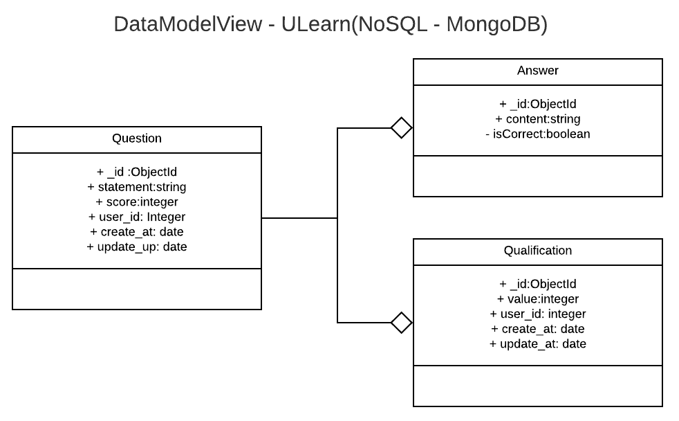

# Microservice ULearn Quiz Building in Golang

Golang + Gin Gonic + mgo (MongoDB)

### Author:

* Luis Miguel Baez Aponte - lmbaeza@unal.edu.co
* Arquitectura de Software - 2020-I

### Build

```shell
sudo docker-compose build
```

```shell
sudo docker-compose up
```

### Data Model


